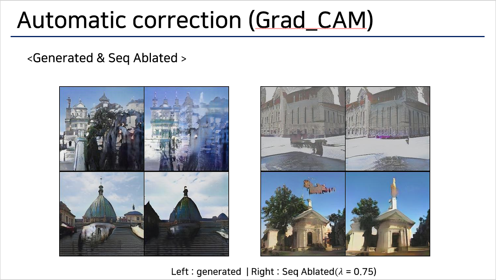
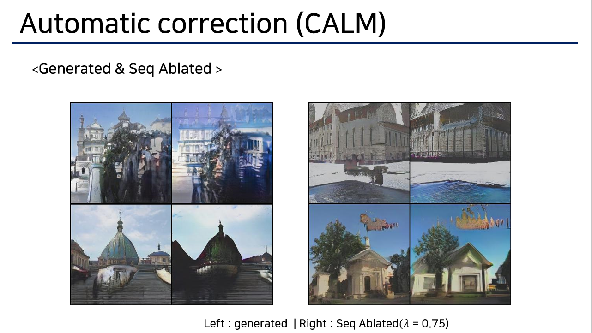

# Automatic correction Grad_CAM & CALM

This is code reproducing Automatic Correction of Internal Units in Generative neural network (CVPR 2021)

https://arxiv.org/abs/2104.06118

This code reference CALM 

https://github.com/naver-ai/calm


<br/> <br/> 
In this paper, author tried to find out defective unit (1 channel activation map) which occurs artifact generations, and by removing defective unit they expect artifact images to be repaired.

<br/> 

### To correct artifact they follow two steps.

1. Artifact Unit identification.
2. Sequential Correction.


This paper uses Grad_CAM to get pesudo segmentation map. I wanted to know improved interpretabiltiy tool will improve correction capability


## 1.Artifact Unit Identification
* ### Identifying units which makes artifact.
<br/><br/>


```python
from .disset.defectivescore import DefectiveScore


##### Calculate DefectiveScore 
DS = DefectiveScore() # you can select GRAD_CAM or CALM version
DS.compute_iou()      # Compute mIOU of Internal Units
# The results are saved at ./disset/json/

```

## 2. Sequential Correction
### Code for correction

```python

import torch
from .dissect.correction import Automatic

###### Automatic correcton via class Automatic
AC = Automatic()

z = torch.randn(8, 512, 1, 1)


gen_img, ab_img = AC.ablate_seq(latent_inputs=z, ablate_num=6) # you can get generated image & ablated image. 


```

# Result
## Grad_CAM version
<br/>



<br><br><br>

## CALM version
<br>




I expected CALM will show greater repair ability but actually no.


