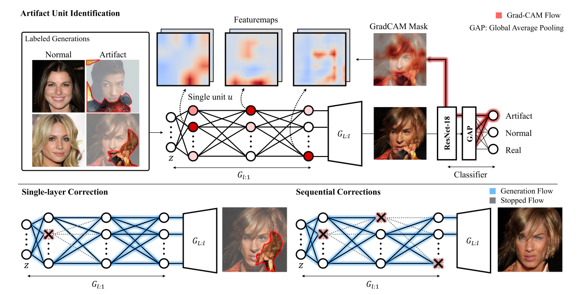
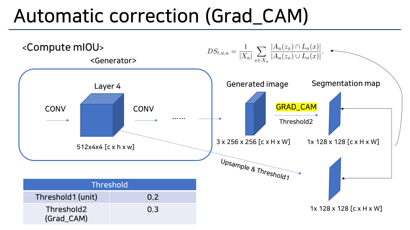

# Automatic correction Grad_CAM & CALM

This is code implementation of Automatic Correction of Internal Units in Generative neural network (CVPR 2021)

https://arxiv.org/abs/2104.06118



Briefly say this paper's goal is to correct artifact which is from Generator's generations.

To correct Artifact they propose two steps.

1. Artifact Unit identification.
2. Sequential Correction.

This paper uses Grad_CAM to get pesudo segmentation map. I wondered CALM will show more improved performance.

CALM :

## 1.Artifact Unit Identification

Identifying units which makes artifact



```python
from .disset.defectivescore import DefectiveScore

##### Calculate DefectiveScore 
DS = DefectiveScore()
DS.compute_iou()  # Compute mIOU of Internal Units
# The results are saved at ./disset/json/

```

## 2. Sequential Correction

```python

import torch
from .dissect.correction import Automatic

###### Automatic correcton via class Automatic
AC = Automatic()

z = torch.randn(8, 512, 1, 1)

gen_img, ab_img = AC.ablate_seq(z, 6) # you can get generated image & ablated image. 


```


